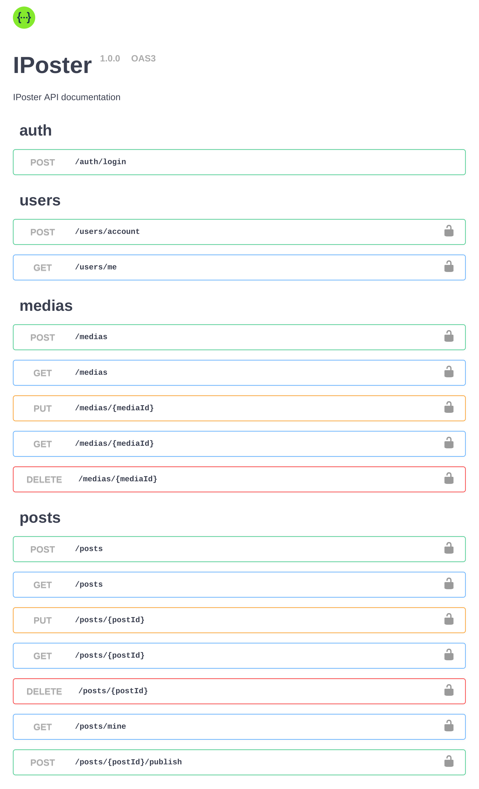

# Typescript backend

It is my attempt to build REST API Using NestJS.

## Table of contents

- [Overview](#CarDeal)
- [Resources](#Resources)
- [Demo](#CarDeal)
- [Built with](#built-with)
- [Local Developement](#Local_Developement)
- [Author](#author)

## CarDeal

CardDeal is a simple fictional application that allows users to get an instant online car valuation. In other words, carDeal helps users to get an estimate of what they car is worth if they planning on buying or selling a car.

## Resources

1. User - to manage authentication and CRUD actions around a user
2. Report - to manage CRUD actions around the valuation report

## Demo

A client is available at:

- Live Site URL: [CarDeal Demo](https://invoicev1.herokuapp.com/)

## Built with

- [Typescript](https://www.typescriptlang.org/docs/) - JavaScript with syntax for types.
- [Nestjs](https://docs.nestjs.com/) - Framework for Node.js that fully supports TypeScript
- [Prisma](https://www.prisma.io/) - Next-gen Node.js and TypeScript ORM
- [PostgreSQL](https://www.postgresql.org/) - Database
- [Redis](https://www.postgresql.org/) - Session storage

## Local_Developement

- **Docker**

  All necessary external services are described in the [./docker-compose.yml](./docker-compose.yaml):

  - Run `docker-compose -f docker-compose.yaml up`
  - Stop `docker-compose -f docker-compose.yaml stop`

  Services:

  1. PostgreSQL - [Credentials](.env).
  1. Redis - [Credentials](.env).

* **Building**

  1. Install libraries - `npm install`
  2. Build application - `npm run build`

* Start application - `npm run start`

  - Expose [./env/local.app.env](./env/local.app.env) and start application - `npm run start:local`

    

      

        API documentation will be available on the endpoint <i>GET <a href="http://localhost:3000/api/" target="_blank" rel="noopener noreferrer">http://localhost:3000/api</a></i>
      

       
      
      
 
          
      

    

* **Testing**

  - Prepare environment - `docker-compose -f docker-compose.test.yaml up -d`
  - Run tests - `npm run test`
  - Run tests with coverage - `npm run test:cov`

## Author

- Website - [Hermann](https://hkfolio.com/)
